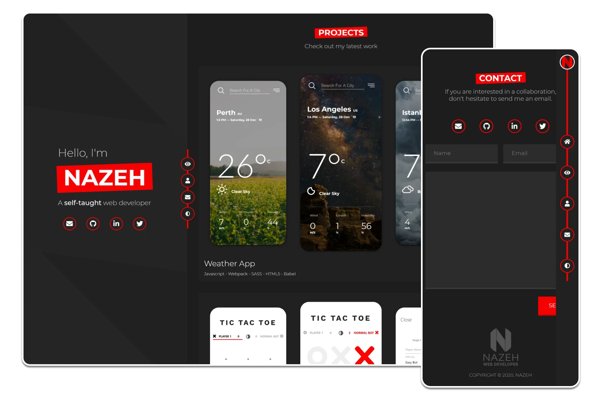
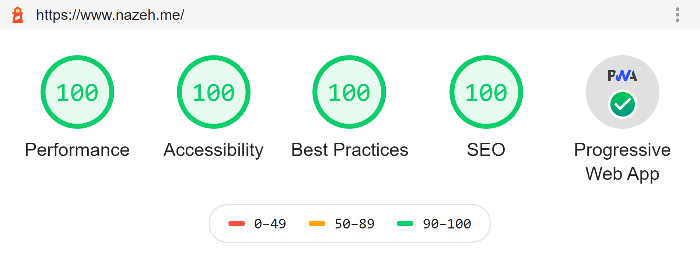

<h1 align="center">Welcome to Personal Portfolio 👋</h1>
<p>
  
  <a href="https://github.com/Nazeh/Portfolio/blob/develop/README.md" target="_blank">
    
  </a>
  <a href="https://github.com/gatsbyjs/gatsby-starter-default/graphs/commit-activity" target="_blank">
    
  </a>
  <a href="https://github.com/Nazeh/Portfolio/blob/develop/LICENSE" target="_blank">
    
  </a>
  <a href="https://twitter.com/arnazeh" target="_blank">
    
  </a>
</p>

> Nazeh Frontend Developer

### ✨ [Demo](https://www.nazeh.me/)



A web development portfolio built with gatsbyjs.

### lighthouse Audit



## Install

```sh
git clone git@github.com:Nazeh/Portfolio.git
npm install
```

## Usage

```sh
gatsby develop
```

## Author

👤 **Nazeh**

- Website: [Nazeh.me](https://www.nazeh.me/)
- Twitter: [@arnazeh](https://twitter.com/arnazeh)
- Github: [@nazeh](https://github.com/nazeh)
- LinkedIn: [@arnazeh](https://linkedin.com/in/arnazeh)

## 🤝 Contributing

Contributions, issues and feature requests are welcome!<br />Feel free to check [issues page](https://github.com/Nazeh/Portfolio/issues).

## Show your support

Give a ⭐️ if this project helped you!

## 📝 License

Copyright © 2020 [Nazeh](https://github.com/nazeh).<br />
This project is [MIT](https://github.com/Nazeh/Portfolio/blob/develop/LICENSE) licensed.
